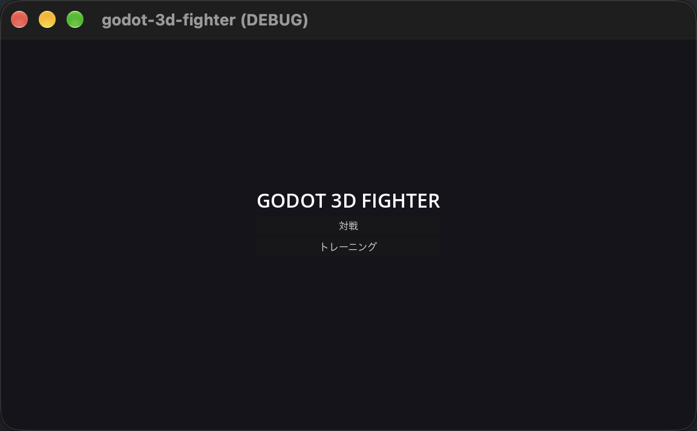
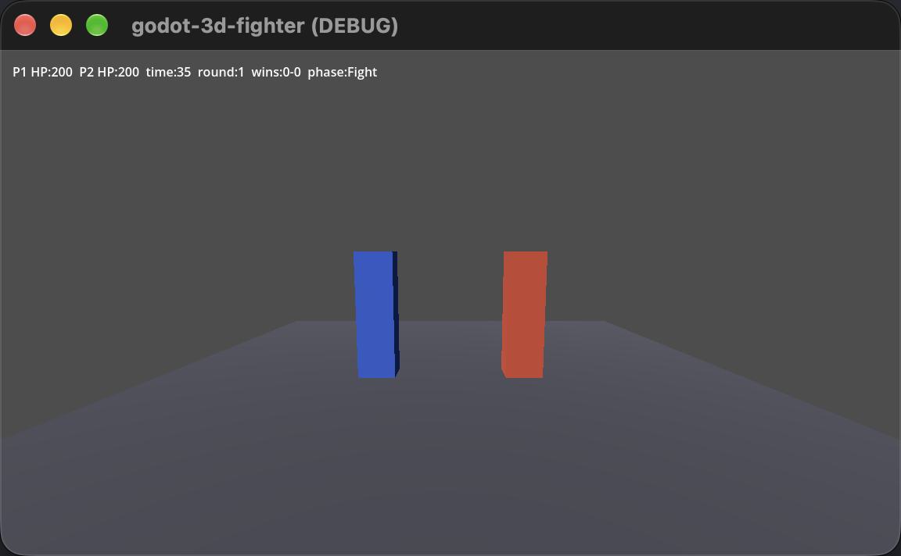

# godot-3d-fighter

Godot 4とC#で作る3D対戦格闘ゲームです。格闘ロジック（Core）はGodotに依存しないC#クラスライブラリとして分離し、整数演算だけで動く決定的なシミュレーションになっています。




## 特徴

- 固定小数点（Q16.16）で動作し、同じ入力列なら機種を問わず同じ結果になります。
- 格闘ロジック（`Core`）と描画・入力（`Godot3dFighter`）を分離しています。
- タイトル、キャラ選択、対戦、リザルト、トレーニングの画面と遷移をひととおり実装しています。
- JSONシナリオで主要導線を自動的に走破できます（E2E）。

## 必要環境

- Godot 4.7.2（.NET版）
- .NET SDK 10.0.400以上

## セットアップ

```sh
brew install --cask godot-mono   # macOSの場合
git clone https://github.com/okamyuji/godot-3d-fighter.git
cd godot-3d-fighter
git config core.hooksPath .githooks
```

## 遊び方

```sh
/Applications/Godot_mono.app/Contents/MacOS/Godot --path .
```

| プレイヤー | 移動 | パンチ | キック | ガード |
|---|---|---|---|---|
| P1 | WASD | J | K | L |
| P2 | 矢印キー | テンキー1 | テンキー2 | テンキー3 |

## ディレクトリ構成

```
.
├── src/Core/       # 格闘ロジック（Godotに依存しない）
├── src/Game/       # 画面、入力、Core呼び出し
├── scenes/         # Godotシーン
├── tests/Core.Tests/ # Coreのユニットテスト（xUnit v3）
├── tests/e2e/      # 主要導線のシナリオ（JSON）
└── docs/           # ADR、設計書
```

## リリースビルド（macOS）

書き出しには4.7.2のエクスポートテンプレートが必要です。Godotエディタの「エディター」メニューにある「エクスポートテンプレートの管理」から導入してください。macOS向けのプリセットは`export_presets.cfg`にあり、次のコマンドで`.app`を書き出せます。

```sh
/Applications/Godot_mono.app/Contents/MacOS/Godot --headless --path . --export-release macOS export/Godot3dFighter.app
```

プリセットは署名を行わず、書き出した`.app`はGodot公式テンプレートの署名のまま手元で起動できます。配布するにはDeveloper IDでの署名と公証が別途必要になります。書き出した実行ファイルでも主要導線を走らせられます。その場合、シナリオは絶対パスで渡します。

```sh
export/Godot3dFighter.app/Contents/MacOS/godot-3d-fighter --headless --fixed-fps 60 -- --e2e "$PWD/tests/e2e/scenarios/f03-knockout.json"
```

## テストとCI

```sh
dotnet test tests/Core.Tests
```

主要導線の走破はヘッドレスのGodotから実行します。

```sh
godot --headless --fixed-fps 60 --path . -- --e2e tests/e2e/scenarios/f03-knockout.json
godot --headless --path . -- --check-flows
```

`git commit`のたびに書式、ビルド、テスト、文書検査がローカルで走ります（`.githooks/pre-commit`）。push時はGitHub Actionsで行カバレッジ、CRAP値、変異テスト、E2Eも含めた全項目を検査します。

## ドキュメント

- [ADR一覧](docs/adr/README.md) — 設計上の決定とその理由
- [設計書](docs/design/README.md) — 型、試合の処理、不変条件とテストの対応表
